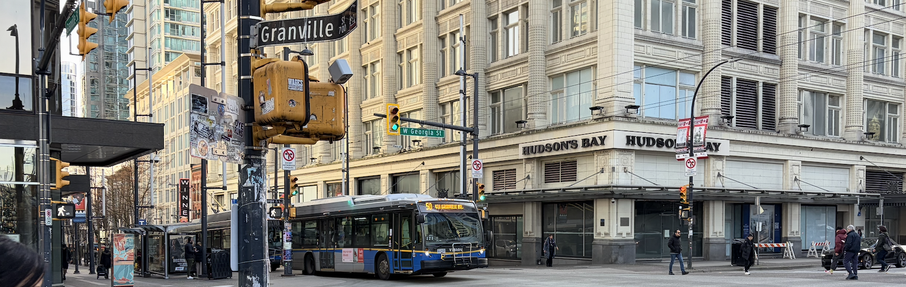

---

##### Another freaking website? What's this about?

My goal with these posts is to appeal to a broad audience's curiousities about transit and how it impacts our cities. My selfish desire is to understand things better by writing about them.

---

##### Here's a random map I made for testing

<iframe
    src="/maps/seattle_frequent_routes.html"
    title="Frequent Routes: King County Metro"
    style="width: 100%; aspect-ratio: 4 / 3; border: none;">
</iframe>

---

_Note: "Another website? Why?" Provide an ad-less, digestible space for learning about transit and our cities._