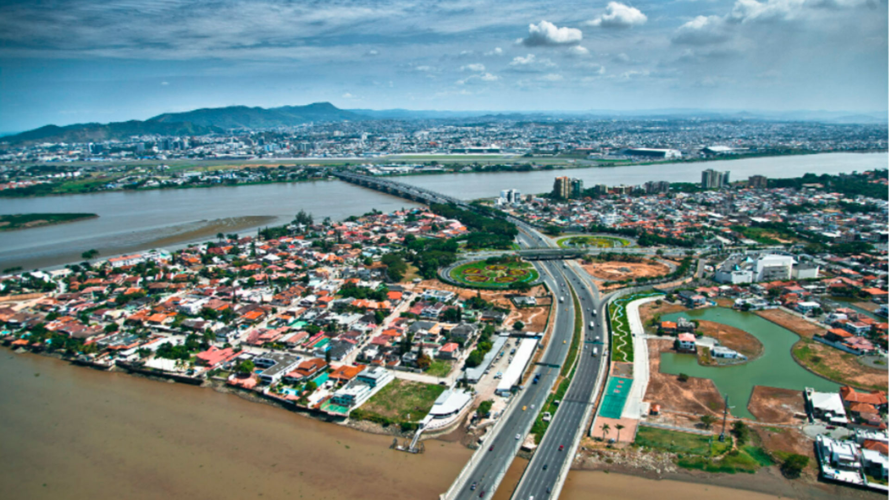

---

This is a story to be expanded on as my thoughts come in, but I have long needed a channel for my frustrations with the urban transformation that my home city underwent. I want to cover how crime and government subsidies led to a massive suburbanization that included the lower middle class, and how I suspect this may be firing up car dependency, sedentarism, air pollution, and social isolation...

---

##### Here's a random map I made for testing

<iframe
    src="/maps/guayaquil_map.html"
    title="Guayaquil's suburban centers"
    style="width: 100%; aspect-ratio: 4 / 3; border: none;">
</iframe>

---

_Note: "Another website? Why?" Provide an ad-less, digestible space for learning about transit and our cities._

---

